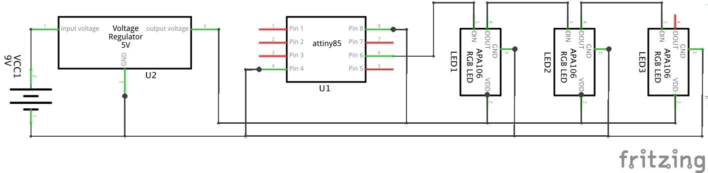
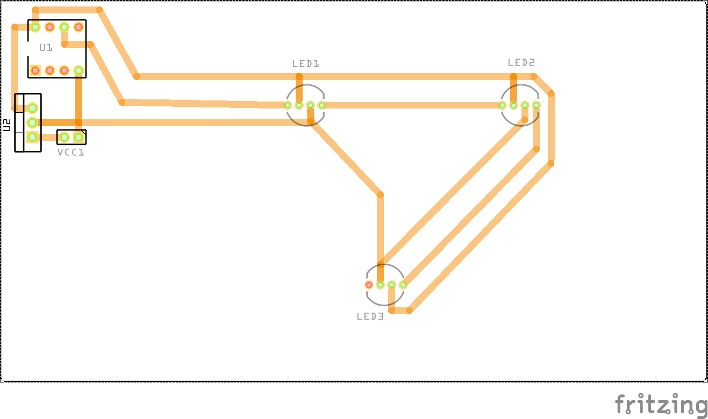

# Projekt Brut-Kasten

## Aufbau 'Proof of Concept'
Die RGB LED's vom Typ APA106-8 haben jeweils einen digitalen Ein- und Ausgang. Somit kann man relativ einfach viele LED's mit nur einem digitalem Pin des Arduino ansteuern. 
Um zu sehen ob die Idee mit einem Arduino-Board, APA106-8 RGB LED und der Neo-Pixel Bibliothek funktioniert habe ich folgenden Aufbau gemacht:

Und es funktionierte auf anhieb. Nun kann man die Leiterplatte bauen.

## Bau der Leiterplatte
Zunächst Portieren wir das ganze mal von einem Arduino Duemilanove auf einen Atmel ATTiny45/85 (je nachdem wieviel Programmspeicher benötitig wird 4kB oder 8 kB). Hier das Schema mit 6 RGB-LED's:

Und die entsprechende Leiterplatte:

Um den ATTiny45/85 zu programmieren verwenden wir den Arduino als Programmier-Gerät ([hier eine Anleitung](http://highlowtech.org/?p=1695)).

## Werkzeuge und Material
* [Arduino IDE](http://www.arduino.cc/)
* [Fritzing.org EDA](http://www.fritzing.org/)
* Arduino Duemilanove
* Steckplatine
* RGB LED [APA106-F8](https://cdn.sparkfun.com/datasheets/Components/LED/COM-12877.pdf)
* Mikrokontroller [ATTiny85 (oder ATTiny45)](http://www.atmel.com/images/atmel-2586-avr-8-bit-microcontroller-attiny25-attiny45-attiny85_datasheet.pdf)
* Spannungsregler [7805](https://www.sparkfun.com/datasheets/Components/LM7805.pdf)
* Rayher [Holz-Schatulle](https://rayher-hobby-shop.de/Basteltrends-Aktuelles/Saisonthemen/Hochzeit-Liebe/Accessoires/Boxen-Schachteln/Holz-Schatulle-FSC-Mix-Credit-1.html)
* Rayher [Plastik Eier 4,5 cm](https://rayher-hobby-shop.de/Brands-Aktuelles/Ostern/Deko-Artikel-O1/Aug-13/Plastik-Eier-oxid-2.html)
